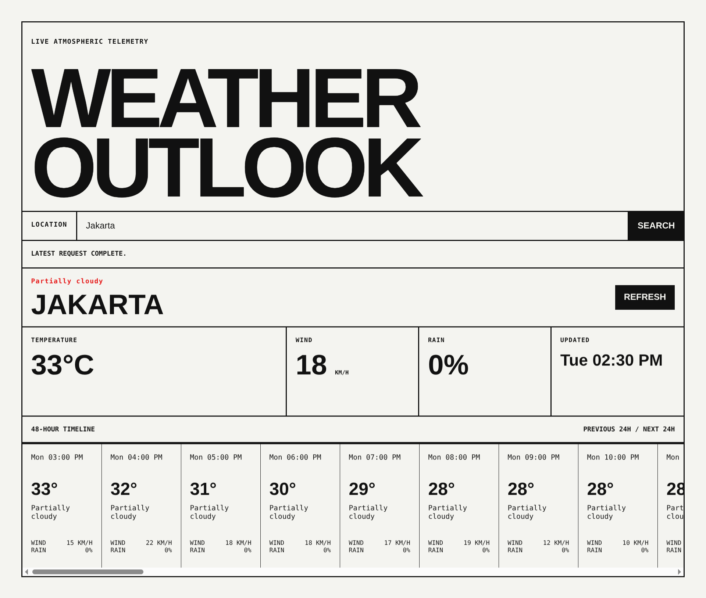

# Weather Outlook

A responsive weather dashboard for searching locations and viewing current conditions alongside a 48-hour timeline. Built with React, TypeScript, and Vite, using data from the [Visual Crossing Weather API](https://www.visualcrossing.com/weather-api/).

Built as part of the [Weather Web App project](https://roadmap.sh/projects/weather-app) from roadmap.sh.



## Features

- Search by city or location
- Current temperature, wind speed, rain probability, and update time
- Hourly conditions for the previous and next 24 hours
- Refresh the latest location without re-entering it
- Loading, API error, and invalid-response handling
- Responsive, keyboard-accessible interface with reduced-motion support

## Tech stack

- React 19
- TypeScript 6
- Vite 8
- Visual Crossing Weather API
- Node.js built-in test runner
- Oxlint

## Prerequisites

- [Node.js](https://nodejs.org/) 22 or later
- npm
- A [Visual Crossing API key](https://www.visualcrossing.com/sign-up/)

## Getting started

1. Clone the repository and enter the project directory.
2. Install dependencies:

   ```bash
   npm install
   ```

3. Create a `.env` file in the project root:

   ```dotenv
   VITE_VISUAL_CROSSING_API_KEY=your_api_key
   ```

4. Start the development server:

   ```bash
   npm run dev
   ```

5. Open the local URL printed by Vite.

> [!IMPORTANT]
> Variables prefixed with `VITE_` are bundled into browser code. Use an API key with appropriate quotas and restrictions, and do not reuse a sensitive server-side credential.

## Available scripts

| Command | Description |
| --- | --- |
| `npm run dev` | Start the Vite development server |
| `npm run build` | Type-check and create a production build in `dist/` |
| `npm run preview` | Preview the production build locally |
| `npm run test` | Run weather data validation and timeline tests |
| `npm run lint` | Check the code with Oxlint |
| `npm run typecheck` | Run the TypeScript compiler without emitting files |

## How it works

The app first requests current conditions to determine the location's local date and timezone. It then fetches the surrounding date range, validates every field consumed by the UI, and selects hourly records within 24 hours before and after the current observation.

All API calls run directly in the browser. A new search cancels the previous in-flight request to prevent stale results from replacing newer data.

## Production build

```bash
npm run build
npm run preview
```

The generated static files are written to `dist/` and can be deployed to any static hosting service. Configure `VITE_VISUAL_CROSSING_API_KEY` before building because Vite injects it at build time.

## Project structure

```text
src/
├── App.tsx           # Search flow and dashboard UI
├── main.tsx          # React entry point
├── styles.css        # Responsive visual design
├── weather.ts        # API response validation and hourly selection
└── weather.test.ts   # Minimal unit tests
```
